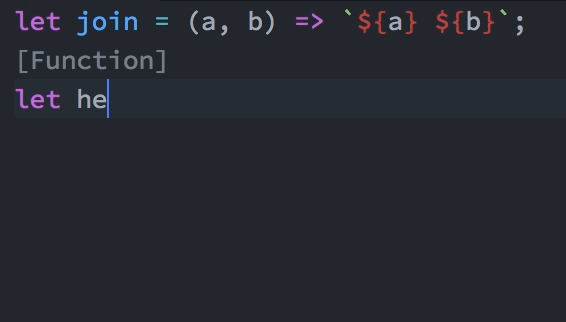

# JS Playgrounds

> Experimental editor agnostic in-line evaluation: like Swift playgrounds, only for JS!

Underneath, it's a combination of Babel plugin that wraps every expression in a function call so it would save the data.
Then it runs it (using `node`), stores all the console information and returns a JSON result with data for the playground (inspection for each line) and the console.
Should be awesome for live coding sessions in your favorite editor.

Eventually, I think the repo could be changed to plain "playgrounds": I want to make everything as agnostic as it can in terms of language, tools and editors.

## Packages

- [`packages/atom-js-playground`](packages/atom-js-playground) - Atom plugin
- [`packages/babel-plugin-js-playgrounds`](packages/babel-plugin-js-playgrounds) - Babel plugin that adds the functionality.
- [`packages/js-playgrounds-cli`](packages/js-playgrounds-cli) - A CLI version of the above
- [`packages/js-playgrounds`](packages/js-playgrounds) - The small library that the Babel plugin adds to report stuff.

## Things I hope to do in the future

I will accept PRs from others, of course:

- [ ] Vim plugin
- [x] Atom plugin
- [ ] VSCode plugin
- [ ] CodeSandbox integration (if VSCode isn't enough for that)
- [ ] Reason file support using BuckleScript
- [ ] Ruby? Python?

## Development

This repo uses Yarn Workspaces, so install `yarn`, and every library we use should hoist to the root of the repo :smile_cat:
